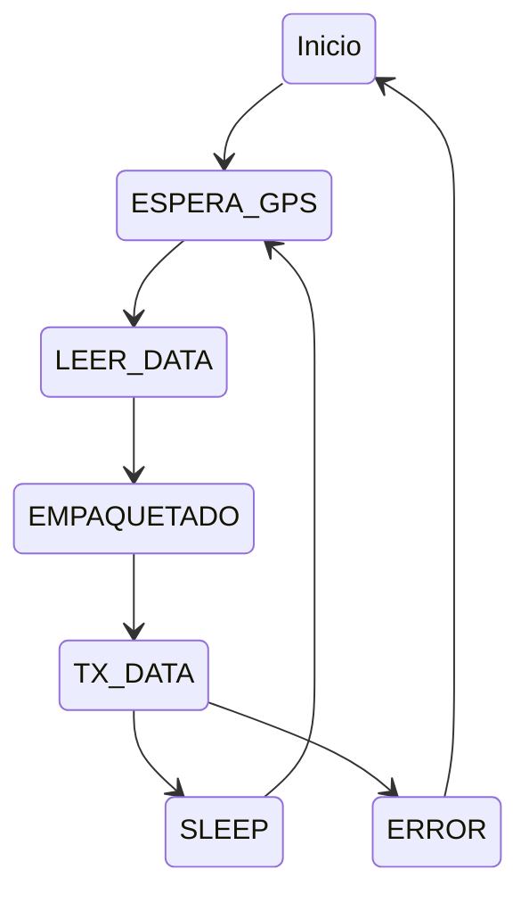
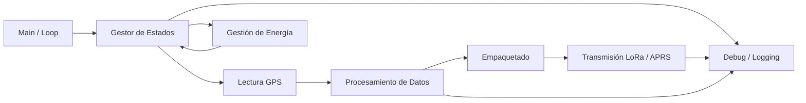

# Sistema de Comunicaciones LoRa/APRS - Módulos Tracker

Este proyecto consiste en la investigación, diseño e implementación de un sistema de comunicaciones basado en las tecnologías **APRS** (Automatic Packet Reporting System) y **LoRa** (Long Range) para la adquisición y transmisión de datos de posicionamiento y telemetría.

## Información del Proyecto
* **Curso:** Taller Integrador
* **callsign:** Ti0Tec6-7
* **Grupo:** #6
* **Integrantes:**
    * Oscar David Conejo Cantón
    * Luis Diego Sandí Quesada
* **Institución:** Tecnológico de Costa Rica 

## Objetivo General
Desarrollar e implementar el firmware para los módulos tracker del sistema de comunicaciones LoRa/APRS, permitiendo la adquisición de información de posicionamiento y su transmisión mediante protocolos de comunicación inalámbrica de baja potencia y largo alcance, garantizando un funcionamiento eficiente y confiable.

## Objetivos Específicos
* Diseñar e implementar el firmware del módulo tracker, integrando periféricos como el módulo GPS y el módulo de comunicación inalámbrica.
* Desarrollar el sistema de transmisión de datos para el envío de información de posición y telemetría mediante tecnologías LoRa o APRS.
* Realizar pruebas y validación del firmware, verificando la correcta adquisición de datos y la confiabilidad de la comunicación.

## Fundamentos Técnicos

### APRS (Automatic Packet Reporting System)
Sistema de comunicaciones digitales por radio que permite la transmisión de información en tiempo real (posición GPS, mensajes, telemetría). Utiliza principalmente bandas VHF/UHF y se basa en el protocolo AX.25.

### LoRa (Long Range)
Tecnología de modulación de espectro ensanchado (CSS) diseñada para comunicaciones de largo alcance con un consumo energético mínimo, ideal para aplicaciones de Internet de las Cosas (IoT).

### Marco Regulatorio (Costa Rica)
El sistema opera bajo los lineamientos del **Plan Nacional de Atribución de Frecuencias (PNAF)**:
* **Banda LoRa:** 902-928 MHz (Uso libre).
* **Potencia:** PIRE máxima de 30 dBm (1 W) en la banda de 902-940 MHz.
* **Normativa:** Regulado por el MICITT y supervisado técnicamente por la SUTEL.

## Arquitectura del Firmware
## Máquina de estados del firmware

## Diagrama de bloques del firmware

# 🚧 Sistema de Monitoreo Estructural de Puentes con LoRa

Este proyecto presenta el diseño y desarrollo inicial de un sistema de monitoreo estructural de puentes basado en tecnología LoRa, enfocado en aplicaciones de bajo consumo energético y operación en zonas remotas.

---

## 📌 Descripción del Proyecto

El sistema propuesto utiliza un módulo tipo *tracker* capaz de:

- Medir vibraciones estructurales
- Detectar flujo vehicular
- Estimar velocidad de tránsito
- Transmitir datos inalámbricamente a larga distancia

La solución está orientada a entornos donde no existe conectividad tradicional, permitiendo monitoreo remoto eficiente.

---

## 🧩 Arquitectura del Sistema

El sistema se divide en cuatro capas principales:

1. **Adquisición**
   - Acelerómetro (vibraciones)
   - Sensor de distancia (flujo vehicular)

2. **Procesamiento**
   - Microcontrolador ESP32 (LILYGO LoRa)

3. **Comunicación**
   - Tecnología LoRa (433 MHz)

4. **Gestión Energética**
   - Ciclos de *Deep Sleep*
   - Control de sensores mediante MOSFET

---

## 🔧 Hardware Utilizado

| Componente | Descripción |
|----------|------------|
| LILYGO LoRa ESP32 | Microcontrolador + LoRa |
| ADXL345 | Acelerómetro (SPI) |
| VL53L1X | Sensor de distancia ToF (I2C) |
| Batería | Alimentación del sistema |
| MOSFET | Control de energía de sensores |

---

## 🔌 Protocolos de Comunicación

- **SPI**
  - Utilizado para el acelerómetro (ADXL345)
  - Alta velocidad para señales dinámicas

- **I2C**
  - Utilizado para el sensor de distancia (VL53L1X)
  - Bajo consumo y simplicidad

- **LoRa (CSS)**
  - Comunicación inalámbrica de largo alcance
  - Baja tasa de datos y bajo consumo energético

---

## 📡 Configuración LoRa

- Frecuencia: **433 MHz**
- Spreading Factor: **SF10**
- Ancho de banda: **250 / 500 kHz**
- Intervalo de transmisión: **20 minutos**

---

## ⚙️ Lógica del Firmware

El sistema sigue un flujo basado en máquina de estados:

1. Despertar (RTC)
2. Activar sensores (MOSFET)
3. Adquirir datos
4. Transmitir datos por LoRa
5. Esperar ACK (confirmación)
6. Entrar en Deep Sleep

👉 Se implementa control de reintentos en caso de falla de comunicación.

---

## 📦 Trama de Datos

Formato de transmisión:
Ejemplo: TI0TEC6-7, 9911951, -84087751, 3416, 520, 120, 92

---

## 📅 Cronograma

| Semana | Actividad |
|------|----------|
| 1 | Lectura de sensores |
| 2 | Procesamiento de datos |
| 3 | Comunicación LoRa |
| 4 | Integración del sistema |
| 5 | Optimización energética |
| 6 | Pruebas de transmisión |
| 7 | Validación en campo |
| 8 | Documentación |

---

## 💰 Presupuesto

| Componente | Costo (USD) |
|----------|------------|
| LILYGO LoRa ESP32 | 20 |
| ADXL345 | 5 |
| VL53L1X | 6 |
| Batería | 8 |
| Regulador | 5 |
| Otros | 5 |
| **Total** | **49 USD** |

---

## 🎯 Objetivos

- Diseñar un sistema autónomo de bajo consumo
- Medir variables estructurales relevantes
- Implementar comunicación de largo alcance con LoRa

---

## 📊 Aplicaciones

- Monitoreo de puentes
- Infraestructura vial
- Sistemas IoT en zonas remotas
- Mantenimiento predictivo

---

## ✅ Conclusiones

- El sistema es viable para monitoreo en zonas remotas
- Permite operación prolongada con bajo consumo energético
- Facilita el mantenimiento preventivo basado en datos

---

## 📡 Tecnologías Utilizadas

- ESP32
- LoRa (SX1278)
- IoT
- Sistemas Embebidos

---
