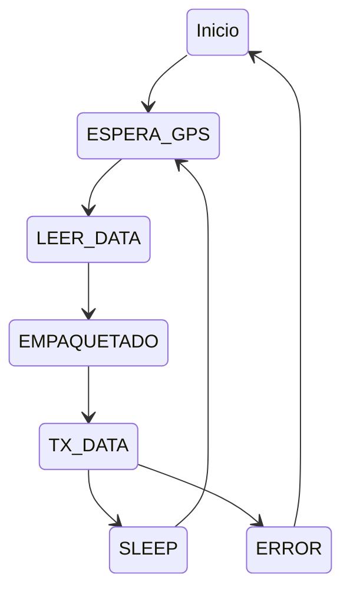
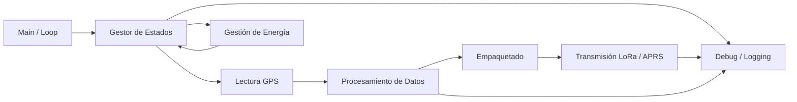

# Sistema de Comunicaciones LoRa/APRS - Módulos Tracker

Este proyecto consiste en la investigación, diseño e implementación de un sistema de comunicaciones basado en las tecnologías **APRS** (Automatic Packet Reporting System) y **LoRa** (Long Range) para la adquisición y transmisión de datos de posicionamiento y telemetría.

## Información del Proyecto
* **Curso:** Taller Integrador
* **callsign:** Ti0Tec6-7
* **Grupo:** #6
* **Integrantes:**
    * Oscar David Conejo Cantón
    * Luis Diego Sandí Quesada
* **Institución:** Tecnológico de Costa Rica 

## Objetivo General
Desarrollar e implementar el firmware para los módulos tracker del sistema de comunicaciones LoRa/APRS, permitiendo la adquisición de información de posicionamiento y su transmisión mediante protocolos de comunicación inalámbrica de baja potencia y largo alcance, garantizando un funcionamiento eficiente y confiable.

## Objetivos Específicos
* Diseñar e implementar el firmware del módulo tracker, integrando periféricos como el módulo GPS y el módulo de comunicación inalámbrica.
* Desarrollar el sistema de transmisión de datos para el envío de información de posición y telemetría mediante tecnologías LoRa o APRS.
* Realizar pruebas y validación del firmware, verificando la correcta adquisición de datos y la confiabilidad de la comunicación.

## Fundamentos Técnicos

### APRS (Automatic Packet Reporting System)
Sistema de comunicaciones digitales por radio que permite la transmisión de información en tiempo real (posición GPS, mensajes, telemetría). Utiliza principalmente bandas VHF/UHF y se basa en el protocolo AX.25.

### LoRa (Long Range)
Tecnología de modulación de espectro ensanchado (CSS) diseñada para comunicaciones de largo alcance con un consumo energético mínimo, ideal para aplicaciones de Internet de las Cosas (IoT).

### Marco Regulatorio (Costa Rica)
El sistema opera bajo los lineamientos del **Plan Nacional de Atribución de Frecuencias (PNAF)**:
* **Banda LoRa:** 902-928 MHz (Uso libre).
* **Potencia:** PIRE máxima de 30 dBm (1 W) en la banda de 902-940 MHz.
* **Normativa:** Regulado por el MICITT y supervisado técnicamente por la SUTEL.

## Arquitectura del Firmware
## Máquina de estados del firmware

## Diagrama de bloques del firmware

