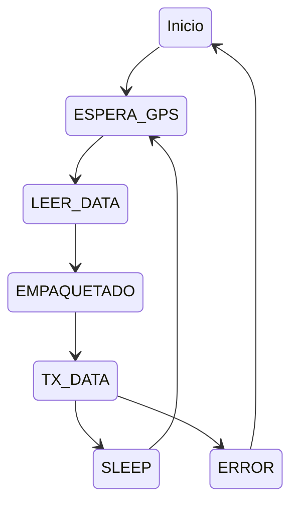
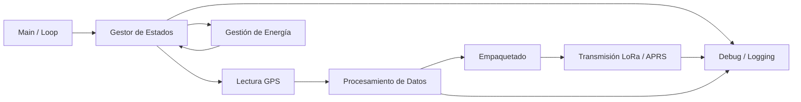

# Sistema de Comunicaciones LoRa/APRS - Módulos Tracker

Este proyecto consiste en la investigación, diseño e implementación de un sistema de comunicaciones basado en las tecnologías **APRS** (Automatic Packet Reporting System) y **LoRa** (Long Range) para la adquisición y transmisión de datos de posicionamiento y telemetría.

## Información del Proyecto.
* **Curso:** Taller Integrador
* **callsign:** Ti0Tec6-7
* **Grupo:** #6
* **Integrantes:**
    * Oscar David Conejo Cantón
    * Luis Diego Sandí Quesada
* **Institución:** Tecnológico de Costa Rica 

## Objetivo General.
Desarrollar e implementar el firmware para los módulos tracker del sistema de comunicaciones LoRa/APRS, permitiendo la adquisición de información de posicionamiento y su transmisión mediante protocolos de comunicación inalámbrica de baja potencia y largo alcance, garantizando un funcionamiento eficiente y confiable.

## Objetivos Específicos.
* Diseñar e implementar el firmware del módulo tracker, integrando periféricos como el módulo GPS y el módulo de comunicación inalámbrica.
* Desarrollar el sistema de transmisión de datos para el envío de información de posición y telemetría mediante tecnologías LoRa o APRS.
* Realizar pruebas y validación del firmware, verificando la correcta adquisición de datos y la confiabilidad de la comunicación.

## Fundamentos Técnicos.

### APRS (Automatic Packet Reporting System)
Sistema de comunicaciones digitales por radio que permite la transmisión de información en tiempo real (posición GPS, mensajes, telemetría). Utiliza principalmente bandas VHF/UHF y se basa en el protocolo AX.25.

### LoRa (Long Range)
Tecnología de modulación de espectro ensanchado (CSS) diseñada para comunicaciones de largo alcance con un consumo energético mínimo, ideal para aplicaciones de Internet de las Cosas (IoT).

### Marco Regulatorio (Costa Rica)
El sistema opera bajo los lineamientos del **Plan Nacional de Atribución de Frecuencias (PNAF)**:
* **Banda LoRa:** 902-928 MHz (Uso libre).
* **Potencia:** PIRE máxima de 30 dBm (1 W) en la banda de 902-940 MHz.
* **Normativa:** Regulado por el MICITT y supervisado técnicamente por la SUTEL.

## Arquitectura del Firmware.

## Diagrama de Nivel 1

<p align="center">

</p>

## Diagrama de Nivel 2

<p align="center">

</p>

## Diagrama de Nivel 3

<p align="center">

</p>

## Máquina de estados del firmware.


```mermaid
stateDiagram-v2
    Inicio --> ESPERA_GPS
    ESPERA_GPS --> LEER_DATA
    LEER_DATA --> EMPAQUETADO
    EMPAQUETADO --> TX_DATA
    TX_DATA --> SLEEP
    SLEEP --> ESPERA_GPS
    TX_DATA --> ERROR
    ERROR --> Inicio
```


## Diagrama de bloques del firmware.


```mermaid
flowchart LR
    A[Main / Loop] --> B[Gestor de Estados]

    B --> C[Lectura GPS]
    C --> D[Procesamiento de Datos]
    D --> E[Empaquetado]
    E --> F[Transmisión LoRa / APRS]

    B --> G[Gestión de Energía]
    B --> H[Debug / Logging]

    G --> B
    F --> H
    D --> H
```


# 🚧 Sistema de Monitoreo Estructural de Puentes con LoRa.

Este proyecto presenta el diseño y desarrollo inicial de un sistema de monitoreo estructural de puentes basado en tecnología LoRa, enfocado en aplicaciones de bajo consumo energético y operación en zonas remotas.

---

## 📌 Descripción del Proyecto.

El sistema propuesto utiliza un módulo tipo *tracker* capaz de:

- Medir vibraciones estructurales
- Detectar flujo vehicular
- Estimar velocidad de tránsito
- Transmitir datos inalámbricamente a larga distancia

La solución está orientada a entornos donde no existe conectividad tradicional, permitiendo monitoreo remoto eficiente.

---

## 🧩 Arquitectura del Sistema.

El sistema se divide en cuatro capas principales:

1. **Adquisición**
   - Acelerómetro (vibraciones)
   - Sensor de distancia (flujo vehicular)

2. **Procesamiento**
   - Microcontrolador ESP32 (LILYGO LoRa)

3. **Comunicación**
   - Tecnología LoRa (433 MHz)

4. **Gestión Energética**
   - Ciclos de *Deep Sleep*
   - Control de sensores mediante MOSFET

---

## 🔧 Hardware Utilizado.

| Componente | Descripción |
|----------|------------|
| LILYGO LoRa ESP32 | Microcontrolador + LoRa |
| ADXL345 | Acelerómetro (SPI) |
| VL53L1X | Sensor de distancia ToF (I2C) |
| Batería | Alimentación del sistema |
| MOSFET | Control de energía de sensores |

---

## 🔌 Protocolos de Comunicación.

- **SPI**
  - Utilizado para el acelerómetro (ADXL345)
  - Alta velocidad para señales dinámicas

- **I2C**
  - Utilizado para el sensor de distancia (VL53L1X)
  - Bajo consumo y simplicidad

- **LoRa (CSS)**
  - Comunicación inalámbrica de largo alcance
  - Baja tasa de datos y bajo consumo energético

---

## 📡 Configuración LoRa.

- Frecuencia: **433 MHz**
- Spreading Factor: **SF10**
- Ancho de banda: **250 / 500 kHz**
- Intervalo de transmisión: **20 minutos**

---

## ⚙️ Lógica del Firmware.

El sistema sigue un flujo basado en máquina de estados:

1. Despertar (RTC)
2. Activar sensores (MOSFET)
3. Adquirir datos
4. Transmitir datos por LoRa
5. Esperar ACK (confirmación)
6. Entrar en Deep Sleep

👉 Se implementa control de reintentos en caso de falla de comunicación.

---

## 📦 Trama de Datos.

Formato de transmisión:
Ejemplo: TI0TEC6-7, 9911951, -84087751, 3416, 520, 120, 92
---

## Comprobación de funcionamiento inicial.
<p align="center">

</p>

## Comprobación de Transmisión a Gate del grupo.
<p align="center">

</p>

## 📅 Cronograma.

| Semana | Actividad |
|------|----------|
| 1 | Lectura de sensores |
| 2 | Procesamiento de datos |
| 3 | Comunicación LoRa |
| 4 | Integración del sistema |
| 5 | Optimización energética |
| 6 | Pruebas de transmisión |
| 7 | Validación en campo |
| 8 | Documentación |

---

## 💰 Presupuesto (Se debe considerar añadir el pago de los ingenieros con respecto al tiempo empleado).


### 1. Costos de los Materiales.
| Componente | Costo (USD) |
|----------|------------|
| LILYGO LoRa ESP32 | 20 |
| ADXL345 | 5 |
| VL53L1X | 6 |
| Batería | 8 |
| Regulador | 5 |
| Otros | 5 |
| **Total** | **49 USD** |

49 dolares que pasan a 22548.82 colones con el tipo de cambio actual a 460.18

### 2. Honorarios Profesionales.
Con base en la tarifa mínima por hora profesional establecida por el Colegio Federado de Ingenieros y de Arquitectos.
---
| Descripción | Tiempo Invertido | Tarifa por Hora | Subtotal (Colones) |
| :--- | :---: | :---: | :--- |
| Desarrollo de firmware, integración de sensores y pruebas de transmisión | 40 horas | ¢37,700 | ¢1,508,000 |
| **Total de Honorarios** | | | **¢1,508,000** |
---
Para un total de ¢1,530,548.82

## 🎯 Objetivos.

- Diseñar un sistema autónomo de bajo consumo
- Medir variables estructurales relevantes
- Implementar comunicación de largo alcance con LoRa

---

## 📊 Aplicaciones.

- Monitoreo de puentes
- Infraestructura vial
- Sistemas IoT en zonas remotas
- Mantenimiento predictivo

---

## ✅ Conclusiones.

- El sistema es viable para monitoreo en zonas remotas
- Permite operación prolongada con bajo consumo energético
- Facilita el mantenimiento preventivo basado en datos

---


## 📡 Tecnologías Utilizadas.

- ESP32
- LoRa (SX1278)
- IoT
- Sistemas Embebidos

---

--- 
## Configuración LoRa.
| Parámetro | Valor | 
|------------|--------| 
| Frecuencia | 433.775 MHz | 
| Potencia TX | 20 dBm | 
| Spreading Factor | SF12 | 
| Bandwidth | 125 kHz | 
| Coding Rate | 4/5 | 
---

## Funcionamiento General.
1. Inicialización de periféricos.
2. Adquisición de datos GPS y sensores.
3. Construcción de tramas APRS.
4. Transmisión mediante LoRa.
5. Recepción por gateway.
6. Publicación en APRS-IS.
7. Visualización en APRS.fi.
8. Retorno a modo de bajo consumo.

---

## Resultados Obtenidos.
Las pruebas realizadas permitieron validar:
- Adquisición correcta de coordenadas GPS.
- Construcción válida de paquetes APRS.
- Transmisión exitosa mediante LoRa.
- Recepción de paquetes por el gateway.
- Publicación correcta en APRS.fi.
- Integración exitosa con infraestructura APRS existente.

---


## Codigo Importante

### GPS
```cpp
 switch (estadoActual) {
    case GPS_CALIBRATION: {
      static bool calIniciado = false;

      if (!calIniciado) {
        calIniciado = true; 
        calTiempoTotal = millis(); 
        calTimerEspera = millis(); 
        calLecturas = 0;
        show_display("GPS", "Reading...", "Lecturas: 0/4", "");
      }      
      // Timeout: si no tienes fix en 15 minutos, salta a SLEEP

      if (millis() - calTiempoTotal > 900000) {
        logger.log(logging::LoggerLevel::LOGGER_LEVEL_WARN, "GPS", "Timeout...");
        estadoActual = SLEEP; 
        calIniciado = false; 
        return;
      }

      if (calEsperandoFix) {

        if (gps.location.isValid() && gps.location.isUpdated()) {
          calLecturas++;
          show_display("GPS", String("Lectura ") + String(calLecturas) + "/4", String(gps.location.lat(),4), "", 2000);

          if (calLecturas >= 4) {
            logger.log(logging::LoggerLevel::LOGGER_LEVEL_INFO, "GPS", "Calibración completada");
            estadoActual = SLEEP; 
            calIniciado = false; 
            return;
          }
          calEsperandoFix = false; 
          calEsperandoPausa = true; 
          calTimerEspera = millis();
        }
        return;
      }

      if (calEsperandoPausa) {
        uint32_t intervalo = calIntervalos[calLecturas - 1];
        if (millis() - calTimerEspera >= intervalo) {
          calEsperandoPausa = false; 
          calEsperandoFix = true; 
          calTimerEspera = millis();
        }
      }
      break;
    }

    case GPS_ON:
      pmu.enableALDO3(); // Encender GPS (Corregido)
      if (gpsOnStart == 0) {
        gpsOnStart = millis();
        show_display("GPS", "Fix...", "", "", 1000);
      }
      if (gps.location.isValid() && gps.location.isUpdated()) {
        gpsOnStart = 0;
        estadoActual = SENSING;
      } else if (millis() - gpsOnStart > TIMEOUT_GPS) {
        gpsOnStart = 0;
        estadoFallo = GPS_ON; estadoActual = ERROR_RETRY;
      }
      break;

    case SENSING:
      if (!gps.location.isValid()) { estadoFallo = SENSING; estadoActual = ERROR_RETRY; return; }
      estadoActual = BUILD_PACKET;
      break; 
```

### Transmisión LoRa
```cpp
 case TX_DATA: {
      pmu.disableALDO3(); // Apagar GPS para ahorrar energía (Corregido)
      
      // Verificar que LoRa esté inicializado
      if (!lora_initialized) {
        logger.log(logging::LoggerLevel::LOGGER_LEVEL_WARN, "TX", "LoRa no inicializado, reintentando...");
        show_display("LORA", "Redo...", "", "", 1000);
        setup_lora();
        if (!lora_initialized) {
          estadoFallo = TX_DATA; 
          estadoActual = ERROR_RETRY;
          break;
        }
      }
      
      // Re-encapsulado rápido para transmisión física
      APRSMessage msg;
      msg.setSource(BeaconMan.getCurrent()->callsign);
      msg.setPath(BeaconMan.getCurrent()->path);
      msg.setDestination("APLT00");
      String lat = create_lat_aprs_dao(gps.location.rawLat());
      String lng = create_long_aprs_dao(gps.location.rawLng());
      String dao = create_dao_aprs(gps.location.rawLat(), gps.location.rawLng());
      String cuerpo = String("!") + lat + BeaconMan.getCurrent()->overlay + lng + BeaconMan.getCurrent()->symbol + String("000/000") + String("/A=000000") + BeaconMan.getCurrent()->message + " " + dao;
      msg.getBody()->setData(cuerpo);
      String trama = msg.encode();

      show_display("<< TX >>", trama.substring(0, 21), "", "", 0);
      logger.log(logging::LoggerLevel::LOGGER_LEVEL_INFO, "TX", "Enviando trama: %s", trama.substring(0, 30).c_str());

      LoRa.beginPacket();
      LoRa.write('<'); LoRa.write(0xFF); LoRa.write(0x01);
      LoRa.write((const uint8_t *)trama.c_str(), trama.length());
      
      if (LoRa.endPacket()) {
        logger.log(logging::LoggerLevel::LOGGER_LEVEL_INFO, "TX", "¡Transmisión exitosa!");
        show_display("TX", "Exitoso", "", "", 2000);
        estadoActual = SLEEP;
      } else {
        logger.log(logging::LoggerLevel::LOGGER_LEVEL_ERROR, "TX", "Fallo en transmisión");
        estadoFallo = TX_DATA; 
        estadoActual = ERROR_RETRY;
      }
      break;
    }
```
### Trama APRS

```cpp
APRSMessage msg;
      msg.setSource(BeaconMan.getCurrent()->callsign);
      msg.setPath(BeaconMan.getCurrent()->path);
      msg.setDestination("APLT00");
      String lat = create_lat_aprs_dao(gps.location.rawLat());
      String lng = create_long_aprs_dao(gps.location.rawLng());
      String dao = create_dao_aprs(gps.location.rawLat(), gps.location.rawLng());
      String cuerpo = String("!") + lat + BeaconMan.getCurrent()->overlay + lng + BeaconMan.getCurrent()->symbol + String("000/000") + String("/A=000000") + BeaconMan.getCurrent()->message + " " + dao;
      msg.getBody()->setData(cuerpo);
      String trama = msg.encode();

      show_display("<< TX >>", trama.substring(0, 21), "", "", 0);
      logger.log(logging::LoggerLevel::LOGGER_LEVEL_INFO, "TX", "Enviando trama: %s", trama.substring(0, 30).c_str());

      LoRa.beginPacket();
      LoRa.write('<'); LoRa.write(0xFF); LoRa.write(0x01);
      LoRa.write((const uint8_t *)trama.c_str(), trama.length());
```

### Smartbeaconing
```cpp
for (JsonVariant v : beacons) {
          BeaconConfig bc;
          bc.callsign = v["callsign"].as<String>();
          bc.path = v["path"].as<String>();
          bc.message = v["message"].as<String>();
          bc.timeout = v["timeout"] | 1;
          bc.symbol = v["symbol"].as<String>();
          bc.overlay = v["overlay"].as<String>();
          bc.smart_beacon.active = v["smart_beacon"]["active"] | false;
          bc.smart_beacon.turn_min = v["smart_beacon"]["turn_min"] | 0;
          bc.smart_beacon.slow_rate = v["smart_beacon"]["slow_rate"] | 300;
          bc.smart_beacon.slow_speed = v["smart_beacon"]["slow_speed"] | 10;
          bc.smart_beacon.fast_rate = v["smart_beacon"]["fast_rate"] | 0;
          bc.smart_beacon.fast_speed = v["smart_beacon"]["fast_speed"] | 0;
          bc.smart_beacon.min_tx_dist = v["smart_beacon"]["min_tx_dist"] | 0;
          bc.smart_beacon.min_bcn = v["smart_beacon"]["min_bcn"] | 0;
          bc.enhance_precision = v["enhance_precision"] | false;
          Config.beacons.push_back(bc);
        }
      }
```

---

## Aplicaciones Potenciales.
- Monitoreo estructural de puentes.
- Infraestructura vial.
- Sistemas IoT en zonas remotas.
- Mantenimiento predictivo.
- Redes de sensores inalámbricos.
- Supervisión de estructuras críticas.


---
